# Bioprocess Analytics and PAT Modeling for Cell Expansion Monitoring

A complete, end-to-end data science pipeline that simulates, processes, models, and reports on bioreactor manufacturing data — from raw sensor signals to machine learning predictions and anomaly detection.

Built entirely on standard Python scientific libraries. No GPU required. Runs on macOS Apple M1.

---

## What This Project Does

In biopharmaceutical manufacturing, cells are grown inside bioreactors under tightly controlled conditions. Engineers monitor dozens of signals in real time — things like electrical capacitance, pH, and oxygen levels — and periodically sample the culture to count cells and measure metabolite concentrations.

This project simulates that environment, then applies the full analytics stack a data scientist would use: data cleaning, machine learning, chemometric modeling, and unsupervised clustering.

---

## Pipeline at a Glance

```
Raw Sensor Data (52,000 rows)
        |
        v
  ETL Pipeline  ──>  SQLite Database
  (3 stages)         (raw / staging / analytics)
        |
        v
  Exploratory      Machine       Spectral       Clustering
  Data Analysis    Learning      Chemometrics   & Anomaly
  (EDA)            (RF + Ridge)  (PLS)          Detection
        |               |              |              |
        +───────────────+--------------+--------------+
                        |
                        v
                  Final Report + Exported CSVs
```

---

## Results from the Latest Run (2026-04-14)

| Metric | Value |
|---|---|
| Total data rows processed | 52,000 |
| Bioreactor batches | 20 |
| Remaining null values after cleaning | 0.0% |
| Anomalous batches flagged | 8 out of 20 |
| Random Forest R2 | 0.9612 |
| Ridge Regression R2 | 0.9251 |
| PLS Glucose R2 | 0.9979 |
| PLS Glutamine R2 | 0.9962 |
| PLS Lactate R2 | 0.9964 |

R2 (R-squared) ranges from 0 to 1. A value above 0.95 means the model explains more than 95% of the variation in the data — essentially very strong predictive accuracy.

---

## Section 1 — Data Simulation and Integration

The pipeline begins by generating two types of data that mirror a real biopharmaceutical process:

**Online data** — continuous sensor readings sampled every ~1.1 minutes over a 48-hour batch run:
- Biocapacitance (pF/cm): a real-time proxy for living cell mass
- pH: acidity of the culture medium
- Dissolved oxygen (DO): oxygen saturation percentage
- Temperature: controlled at 37 degrees Celsius

**Offline assay data** — manual samples taken every 4 hours and analyzed in the lab:
- Viable cell density (VCD): count of live cells per mL
- Cell viability: percentage of cells that are alive
- Glucose, glutamine, and lactate concentrations in millimolar (mM)

These two datasets are merged into one master matrix using a nearest-time join, producing 52,000 rows across 20 batches (20 batches x 2,600 time points each).

**Biocapacitance over time — first 5 batches:**

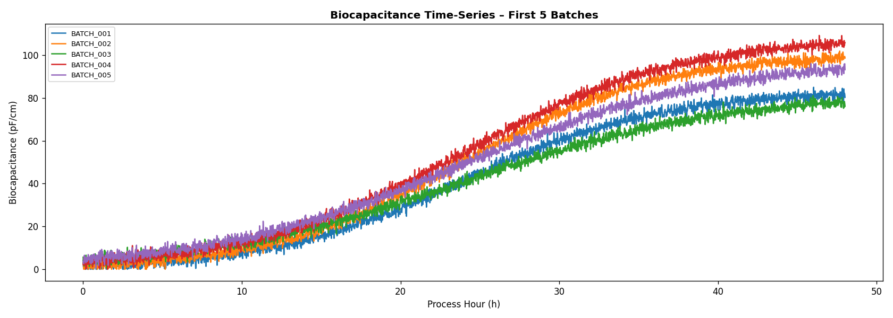

Each line is one bioreactor batch. The S-shaped curve (slow start, rapid growth, plateau) is the hallmark of healthy cell expansion. Notice that different batches reach different maximum values — this batch-to-batch variability is exactly what the clustering section later tries to characterize.

**pH and dissolved oxygen over time:**

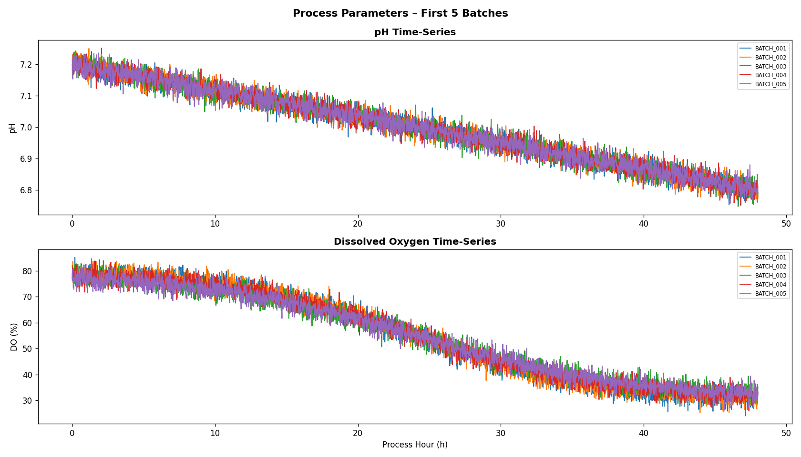

pH drifts slightly downward as cells produce acidic metabolites. Dissolved oxygen drops as growing cells consume more oxygen. These opposing trends are a reliable sign of a productive culture.

---

## Section 2 — ETL Pipeline (Extract, Transform, Load)

Raw data from sensors is never perfectly clean. This section applies a three-stage pipeline to prepare the data for modeling.

| Stage | What happens |
|---|---|
| Raw | Data is stored as-is. About 2% of values are randomly removed to simulate real sensor drop-outs. |
| Staging | Missing values are filled using forward-fill within each batch, then replaced by column medians if still missing. Out-of-range values are clipped. Rows with critically low dissolved oxygen are flagged as warnings. |
| Analytics-ready | Clean data is normalized using Z-score scaling. Rolling 10-point moving averages are added as new features. The final table is written to SQLite. |

Every transformation is recorded in a traceability log table in the database, so the full history of what happened to each data point can be audited.

**Feature distributions after cleaning:**

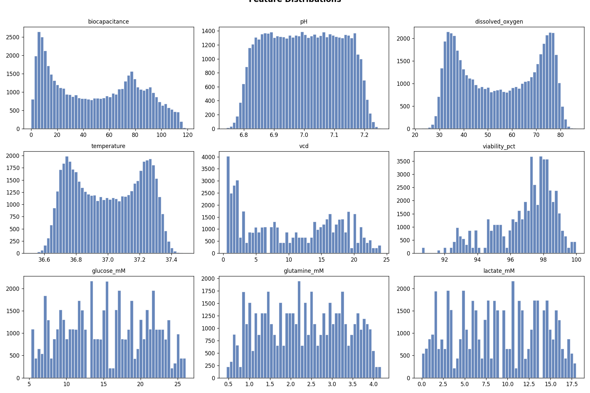

Each panel shows how one variable is distributed across all 52,000 rows. The biocapacitance and VCD distributions show bimodal shapes — lower values early in the batch, higher values later — which is consistent with a growing cell population.

---

## Section 3 — Exploratory Data Analysis

Before modeling, it is important to understand how the variables relate to each other.

**Correlation heatmap:**

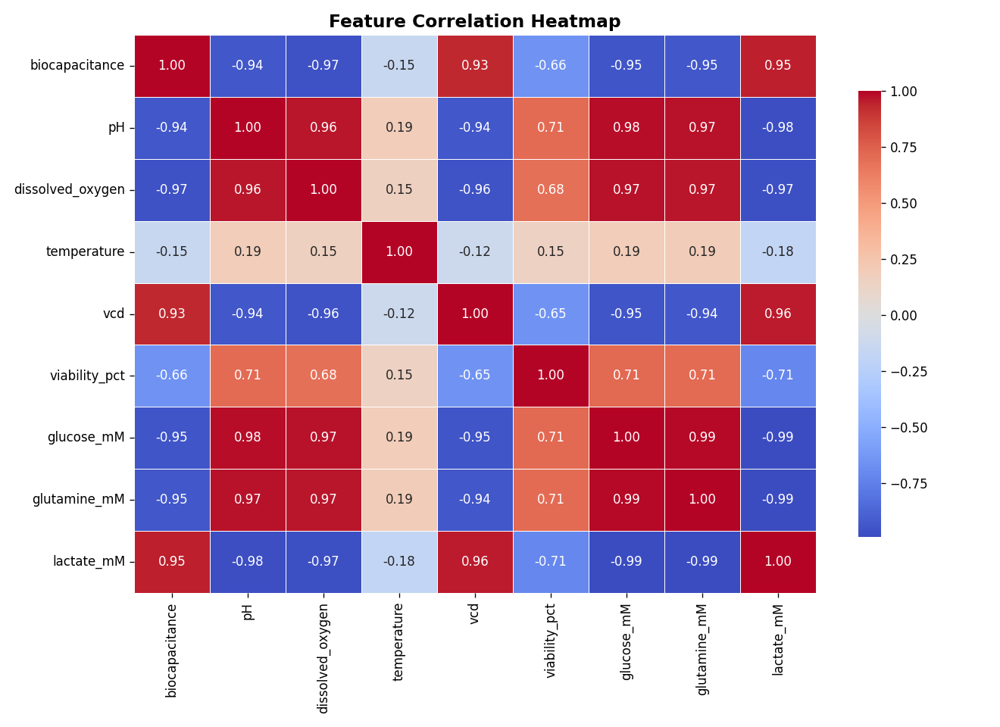

How to read this: each cell shows the correlation between two variables, ranging from -1 (perfectly opposite) to +1 (perfectly in sync). Red means strong positive correlation, blue means strong negative correlation, white means no relationship.

Key observations visible in the heatmap:
- Biocapacitance and VCD are strongly positively correlated — as cell mass increases, the capacitance signal increases. This confirms biocapacitance is a good real-time proxy for cell density.
- Dissolved oxygen and biocapacitance are negatively correlated — growing cells consume oxygen, so DO drops as cell mass rises.
- Glucose and glutamine are positively correlated with each other because both are nutrients that get consumed at similar rates.
- Lactate is negatively correlated with glucose — as glucose gets consumed, lactate gets produced as a byproduct.

---

## Section 4 — Machine Learning Models

The goal: predict viable cell density (VCD) from the five online sensor readings alone, without waiting for a manual lab assay.

**Features used as inputs:**
- Biocapacitance
- pH
- Dissolved oxygen
- Temperature
- Process hour (how far into the batch we are)

**Target to predict:**
- VCD (viable cell density in millions of cells per mL)

The data is split 80/20 into training and test sets. Two models are trained and compared.

### Random Forest Regressor

An ensemble of decision trees that vote on the final prediction. Hyperparameters (number of trees, tree depth, minimum samples per split) are tuned automatically using 3-fold cross-validation grid search.

**Predicted vs. actual VCD:**

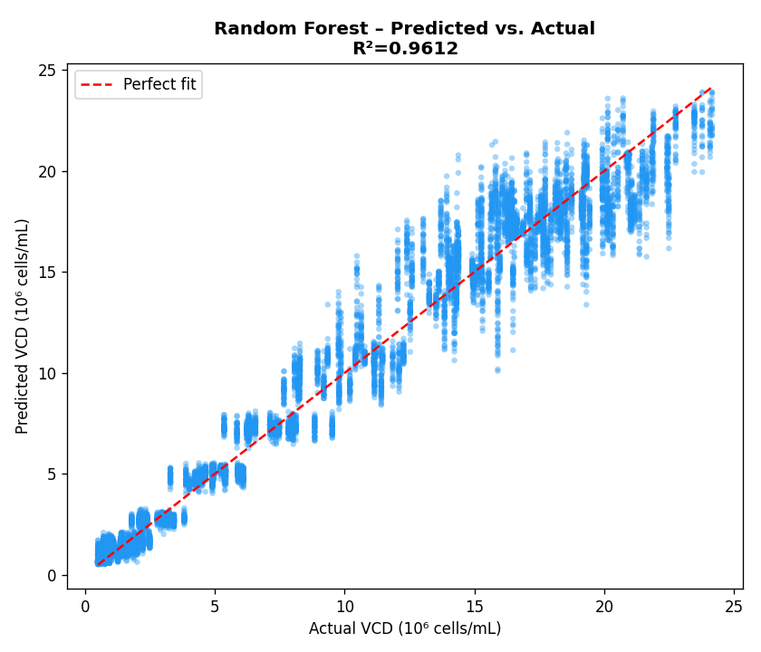

The closer the points are to the red dashed line, the better the prediction. With R2 = 0.9612, the Random Forest captures nearly all of the variation in cell density from sensor data alone.

**Feature importance:**

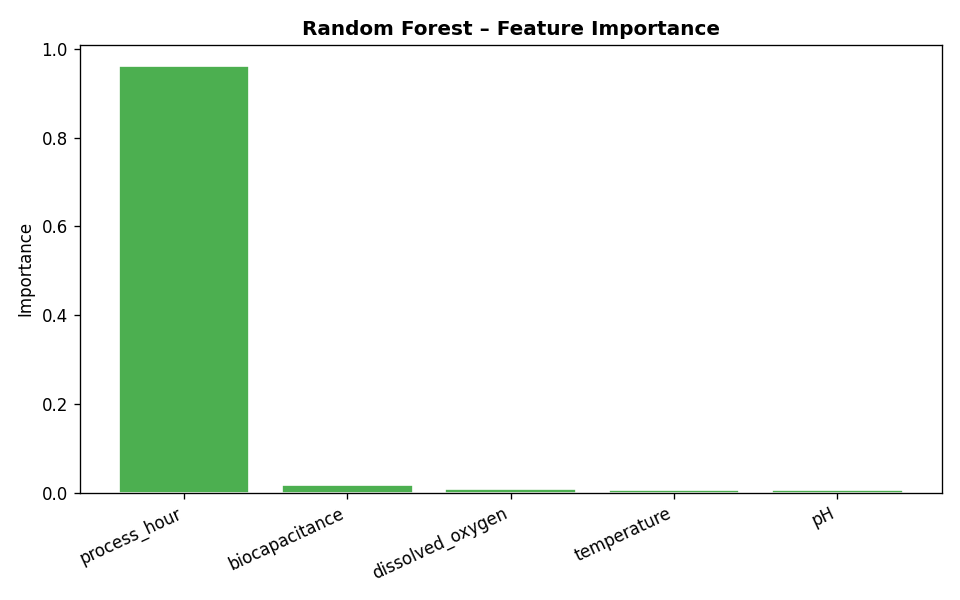

Process hour is the most important feature — this makes biological sense, because how long a batch has been running is a strong predictor of where cells are in their growth cycle. Biocapacitance is the second most important feature, confirming its value as a real-time growth indicator.

### Ridge Regression

A linear model with regularization to prevent overfitting. Simpler than Random Forest but faster and more interpretable. Also tuned with 5-fold cross-validation.

**Residual plot (error analysis):**

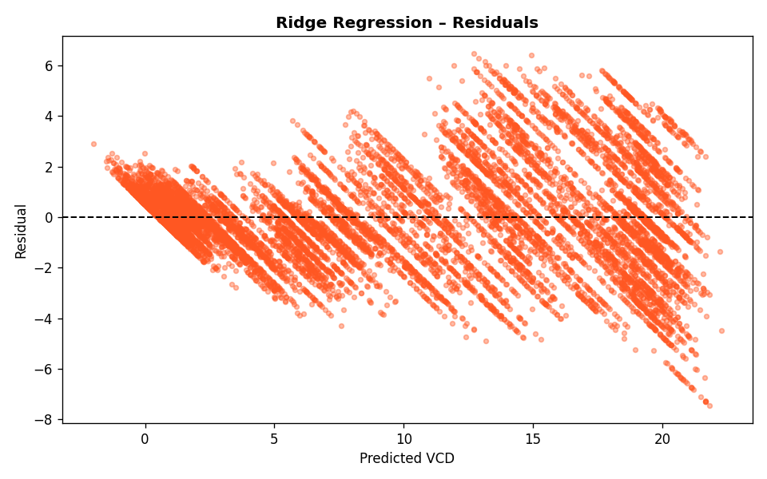

The residual plot shows the prediction error (actual minus predicted) on the vertical axis against the predicted value on the horizontal axis. Points scattered evenly around zero (the dashed line) indicate the model has no systematic bias. Ridge achieves R2 = 0.9251 — strong performance for a linear model on biological data.

### Model Comparison

| Model | R2 | RMSE | MAE | CV R2 |
|---|---|---|---|---|
| Random Forest | 0.9612 | 1.4156 | 1.0114 | 0.9609 |
| Ridge Regression | 0.9251 | 1.9663 | 1.5088 | 0.9251 |

RMSE = Root Mean Squared Error (lower is better). MAE = Mean Absolute Error (lower is better). CV R2 = cross-validation R2, which tests how well the model generalizes to unseen data.

The Random Forest outperforms Ridge on all metrics, but Ridge provides a faster, interpretable baseline that still performs well.

---

## Section 5 — Spectral Data and Chemometrics (PLS)

In advanced bioprocess monitoring, Raman spectroscopy is used to measure metabolite concentrations non-invasively. The sensor shines laser light into the culture and analyzes the scatter pattern — each chemical compound has a unique spectral fingerprint.

This section simulates 2,000 Raman spectra (500 wavenumber channels each) and uses Partial Least Squares (PLS) regression to predict glucose, glutamine, and lactate concentrations directly from the spectrum.

**Mean Raman spectrum across all samples:**

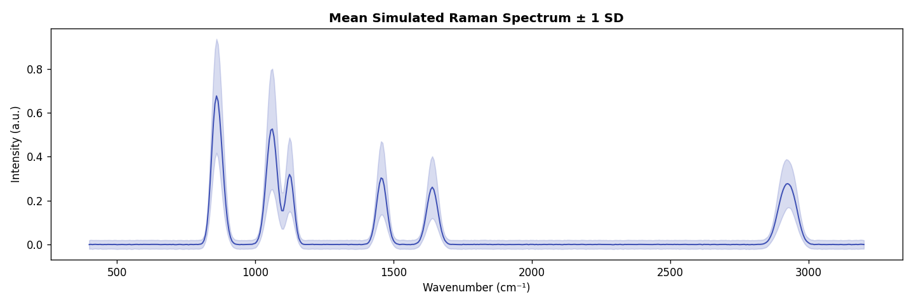

The blue line is the average spectrum across 2,000 samples. The shaded band shows plus/minus one standard deviation, indicating how much the spectra vary between samples. The distinct peaks correspond to known Raman bands of glucose (around 1060 and 1125 cm-1), glutamine (870 cm-1), and lactate (853 and 1457 cm-1).

**PLS predictions for all three analytes:**

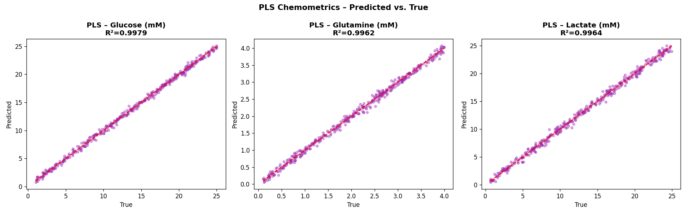

Each panel shows one metabolite. Points on or near the red line mean the model predicted the concentration almost exactly. The optimal number of PLS components was selected automatically by cross-validation to prevent overfitting.

| Analyte | R2 | RMSE (mM) |
|---|---|---|
| Glucose | 0.9979 | 0.3154 |
| Glutamine | 0.9962 | 0.0684 |
| Lactate | 0.9964 | 0.4205 |

All three models achieve R2 above 0.996 — pharmaceutical-grade prediction accuracy from spectral data alone.

---

## Section 6 — Unsupervised Learning and Anomaly Detection

Not all batches behave the same way. Some may underperform due to seed culture variability, media preparation differences, or equipment issues. This section uses K-Means clustering to automatically group the 20 batches by their process behavior, without being told in advance which batches are similar.

**Input features for clustering (one row per batch):**
- Mean, standard deviation, and maximum biocapacitance
- Mean and standard deviation of pH
- Mean and minimum dissolved oxygen
- Maximum VCD achieved
- Mean cell viability

**Cluster visualization (PCA projection):**

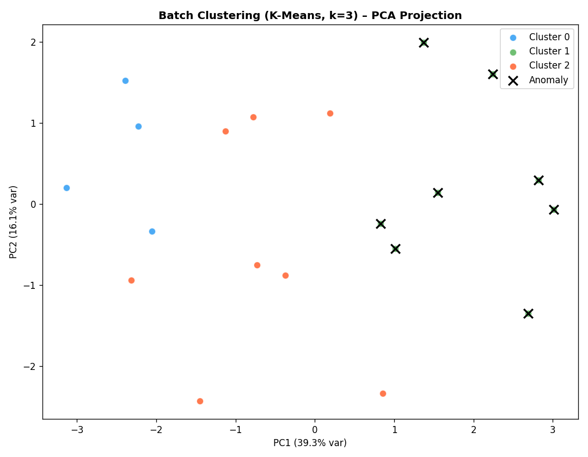

Because the feature space has 8 dimensions, Principal Component Analysis (PCA) is used to compress it into 2 dimensions for visualization. Each dot is one batch, colored by cluster. The X marks are batches that were flagged as anomalous — they belong to the cluster with the lowest average maximum VCD, meaning they failed to reach normal cell density.

8 out of 20 batches were flagged for investigation. In a real manufacturing setting, this would trigger a root cause analysis to identify what went wrong.

**Batch feature clustermap (hierarchical view):**

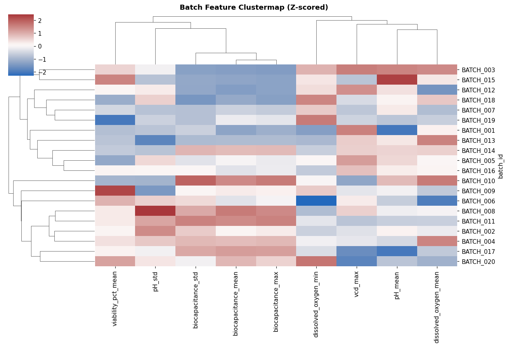

This heatmap shows all 20 batches (rows) across all 8 features (columns), after Z-score normalization. Red = above average, blue = below average. The dendrogram on the left groups batches with similar profiles together. The column dendrogram groups features that tend to move together.

The clear block structure confirms that the three clusters found by K-Means represent genuinely different process behaviors, not random noise.

---

## Project Structure

```
bioprocess_analytics_project/
|
|-- bioprocess_analytics.ipynb    Jupyter notebook (run cell by cell, with inline plots)
|-- bioprocess_analytics.py       Standalone Python script (run all at once)
|-- requirements.txt              Python dependencies
|-- README.md                     This file
|
|-- outputs/                      Generated automatically on first run (git-ignored)
    |-- figures/                  All plots as PNG files
    |-- analytics_data_export.csv Clean analytics-ready dataset
    |-- batch_cluster_report.csv  Per-batch cluster labels and anomaly flags
    |-- bioprocess.db             SQLite database (raw / staging / analytics tables)
    |-- final_report.txt          Console report saved as text
```

---

## Setup and Run on macOS M1

**Step 1 — Create and activate a virtual environment**

```bash
cd /path/to/bioprocess_analytics_project
python3 -m venv .venv
source .venv/bin/activate
```

**Step 2 — Install dependencies**

```bash
pip install -r requirements.txt
```

All packages listed in requirements.txt are version-free. pip will install the latest compatible versions automatically.

**Step 3a — Run as a Jupyter notebook (recommended for beginners)**

```bash
jupyter lab bioprocess_analytics.ipynb
```

This opens a browser window. Run each cell one at a time with Shift+Enter to see plots and outputs inline.

**Step 3b — Run as a Python script (faster, no browser needed)**

```bash
python bioprocess_analytics.py
```

All figures are saved to outputs/figures/. A summary report is printed to the terminal and saved to outputs/final_report.txt.

---

## Dependencies

All standard scientific Python libraries. No GPU. No proprietary packages.

```
pandas
numpy
scikit-learn
matplotlib
seaborn
scipy
notebook
jupyterlab
```

---

## Key Takeaways for Beginners

**Why biocapacitance matters:** It is the only sensor that measures living cell mass in real time without touching the culture. This project demonstrates that biocapacitance alone (combined with process time) can predict cell density with over 96% accuracy, potentially eliminating the need for frequent manual sampling.

**Why PLS for spectra:** Raman spectra contain hundreds of correlated variables. Standard regression fails in this setting. PLS projects both the spectra and the concentrations into a shared latent space and finds the directions of maximum covariance — this is exactly the right tool for spectroscopic calibration.

**Why clustering matters in manufacturing:** Even when all batches follow the same protocol, biological processes are variable. Clustering lets you find which batches deviated without needing to know in advance what a deviation looks like. Flagging 8 of 20 batches for review is not a failure — it is the pipeline doing its job.

---

## Commit to GitHub

After verifying the run completes without errors:

```bash
cd /Users/kevin/Documents/GitHub/Python/Handson_Collection

git add bioprocess_analytics_project/

git status   # confirm only project files are staged

git commit -m "feat: add Bioprocess Analytics and PAT Modeling project

- Simulates 52,000 rows of bioreactor process data across 20 batches
- 3-stage ETL pipeline stored in SQLite with full traceability log
- EDA: correlation heatmap, distributions, time-series plots
- Random Forest (R2=0.96) and Ridge Regression (R2=0.93) for VCD prediction
- PLS chemometrics on simulated Raman spectra (R2 > 0.996 for all analytes)
- K-Means clustering identifies 3 process trajectories, flags 8 anomalous batches
- macOS M1 compatible, no version-pinned dependencies"

git push origin main
```

The outputs/ directory is listed in .gitignore and will not be committed. Generated figures and database files stay local only.
